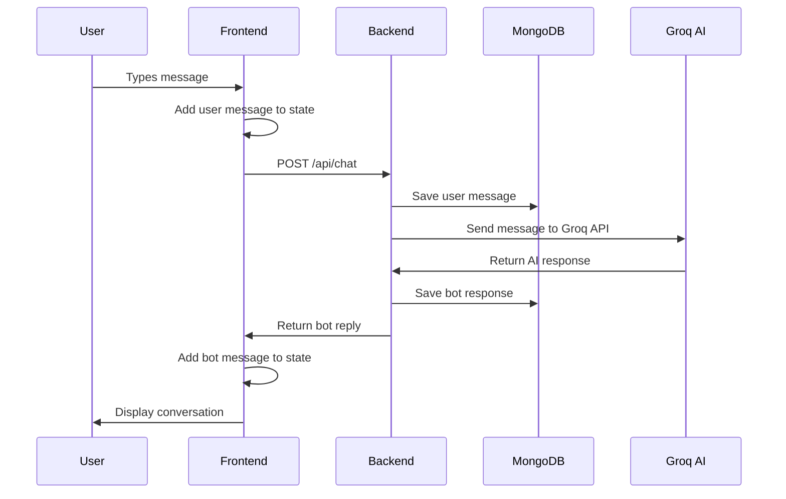

# Frontend-Backend Integration Documentation

## Overview
This document provides a detailed analysis of how the React frontend (`chatbot-frontend`) integrates with the Node.js/Express backend (`chatbot-backend`) in this chat application.

## Architecture Overview

```
┌─────────────────────┐    HTTP Requests    ┌─────────────────────┐
│   React Frontend    │ ──────────────────► │   Express Backend   │
│   (Port 5173)       │                     │   (Port 3001)       │
└─────────────────────┘                     └─────────────────────┘
                                                      │
                                                      ▼
                                            ┌─────────────────────┐
                                            │   MongoDB Database   │
                                            │   (Chat Storage)    │
                                            └─────────────────────┘
```

## Frontend Structure

### Core Components

#### 1. **App.jsx** - Main Application Component
- **Location**: `chatbot-frontend/src/App.jsx`
- **Purpose**: Main application component that manages state and handles API communication
- **Key Features**:
  - Manages `messages` state array
  - Implements `sendMessage` function for API communication
  - Renders `ChatWindow` and `MessageInput` components

#### 2. **ChatWindow.jsx** - Message Display Component
- **Location**: `chatbot-frontend/src/components/ChatWindow.jsx`
- **Purpose**: Displays the chat messages in a scrollable container
- **Styling**: Uses Tailwind CSS for responsive design

#### 3. **MessageInput.jsx** - User Input Component
- **Location**: `chatbot-frontend/src/components/MessageInput.jsx`
- **Purpose**: Handles user input and triggers message sending
- **Features**: Input validation and state management

### Frontend Technology Stack
- **Framework**: React 19.1.1
- **Build Tool**: Vite 7.1.2
- **Styling**: Tailwind CSS 4.1.13
- **Package Manager**: npm
- **Development Server**: Vite dev server (default port 5173)

## Backend Structure

### Core Components

#### 1. **server.js** - Main Server File
- **Location**: `chatbot-backend/server.js`
- **Purpose**: Express server configuration and middleware setup
- **Key Features**:
  - CORS configuration for cross-origin requests
  - JSON parsing middleware
  - Debug logging middleware
  - Route mounting

#### 2. **chatController.js** - API Logic
- **Location**: `chatbot-backend/controllers/chatController.js`
- **Purpose**: Handles chat-related API requests
- **Key Features**:
  - Saves user messages to MongoDB
  - Integrates with Groq AI API
  - Saves bot responses to MongoDB
  - Error handling

#### 3. **Chat.js** - Database Model
- **Location**: `chatbot-backend/models/Chat.js`
- **Purpose**: Mongoose schema for chat messages
- **Schema Fields**:
  - `sender`: String (user/bot)
  - `text`: String (message content)
  - `timestamp`: Date (auto-generated)

#### 4. **chatRoutes.js** - API Routes
- **Location**: `chatbot-backend/routes/chatRoutes.js`
- **Purpose**: Defines API endpoints
- **Routes**:
  - `POST /api/chat` - Handle chat messages

### Backend Technology Stack
- **Runtime**: Node.js
- **Framework**: Express 5.1.0
- **Database**: MongoDB with Mongoose 8.18.1
- **AI Integration**: Groq API (Llama 3.1-8b-instant)
- **Additional Dependencies**:
  - `axios` for HTTP requests
  - `cors` for cross-origin resource sharing
  - `dotenv` for environment variables

## Integration Flow

### 1. **Message Sending Process**



### 2. **API Communication Details**

#### Frontend Request (App.jsx:12-16)
```javascript
const res = await fetch("http://localhost:3001/api/chat", {
  method: "POST",
  headers: { "Content-Type": "application/json" },
  body: JSON.stringify({ message: text }),
});
```

#### Backend Response (chatController.js:28)
```javascript
res.json({ reply: botReply });
```

### 3. **CORS Configuration**

The backend is configured to allow cross-origin requests from the frontend:

```javascript
app.use(cors({
  origin: true, // Allow all origins for debugging
  credentials: true,
  methods: ["GET", "POST", "PUT", "DELETE", "OPTIONS"],
  allowedHeaders: ["Content-Type", "Authorization"]
}));
```

## Data Flow

### 1. **State Management**
- **Frontend State**: React `useState` hook manages `messages` array
- **Backend State**: MongoDB stores persistent chat history
- **Data Synchronization**: Frontend state is updated after successful API calls

### 2. **Message Structure**
```javascript
// Frontend message object
{
  sender: "user" | "bot",
  text: "message content"
}

// Backend database document
{
  sender: "user" | "bot",
  text: "message content",
  timestamp: Date
}
```

## Environment Configuration

### Backend Environment Variables
The backend requires the following environment variables:
- `MONGO_URI`: MongoDB connection string
- `GROQ_API_KEY`: Groq AI API key
- `PORT`: Server port (default: 3001)

### Frontend Configuration
- **Development Server**: Vite dev server on port 5173
- **API Base URL**: Hardcoded to `http://localhost:3001/api`

## Error Handling

### Frontend Error Handling
```javascript
try {
  const res = await fetch("http://localhost:3001/api/chat", {
    method: "POST",
    headers: { "Content-Type": "application/json" },
    body: JSON.stringify({ message: text }),
  });
  const data = await res.json();
  setMessages((prev) => [...prev, { sender: "bot", text: data.reply }]);
} catch (err) {
  console.error(err);
}
```

### Backend Error Handling
```javascript
try {
  // API logic
  res.json({ reply: botReply });
} catch (err) {
  res.status(500).json({ error: err.message });
}
```

## Development Workflow

### Starting the Application

1. **Backend Setup**:
   ```bash
   cd chatbot-backend
   npm install
   # Set up .env file with required variables
   npm start
   ```

2. **Frontend Setup**:
   ```bash
   cd chatbot-frontend
   npm install
   npm run dev
   ```

### Port Configuration
- **Frontend**: http://localhost:5173 (Vite default)
- **Backend**: http://localhost:3001 (Express server)

## Security Considerations

### Current Implementation
- CORS is configured to allow all origins (development only)
- No authentication or authorization implemented
- API keys stored in environment variables

### Production Recommendations
- Implement proper CORS configuration with specific origins
- Add authentication middleware
- Implement rate limiting
- Add input validation and sanitization
- Use HTTPS in production

## Dependencies and Versions

### Frontend Dependencies
```json
{
  "react": "^19.1.1",
  "react-dom": "^19.1.1",
  "tailwindcss": "^4.1.13",
  "@tailwindcss/vite": "^4.1.13"
}
```

### Backend Dependencies
```json
{
  "express": "^5.1.0",
  "mongoose": "^8.18.1",
  "axios": "^1.12.2",
  "cors": "^2.8.5",
  "dotenv": "^17.2.2"
}
```

## Troubleshooting

### Common Issues

1. **CORS Errors**: Ensure backend CORS configuration allows frontend origin
2. **Connection Refused**: Verify backend server is running on port 3001
3. **API Key Issues**: Check environment variables are properly set
4. **Database Connection**: Verify MongoDB connection string and database accessibility

### Debug Features
- Backend includes debug middleware that logs all incoming requests
- Frontend logs errors to console
- Backend logs database connection status

## Future Enhancements

### Potential Improvements
1. **Real-time Communication**: Implement WebSocket for real-time messaging
2. **Authentication**: Add user authentication and session management
3. **Message History**: Implement pagination for chat history
4. **File Uploads**: Support for image and file sharing
5. **Message Status**: Read receipts and delivery status
6. **Offline Support**: Service worker for offline functionality
7. **Testing**: Add unit and integration tests
8. **TypeScript**: Migrate to TypeScript for better type safety

This integration provides a solid foundation for a chat application with AI capabilities, using modern web technologies and following RESTful API principles.
